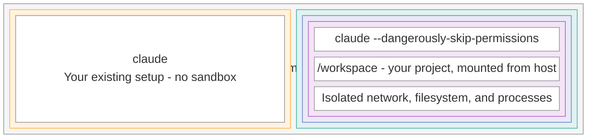

# ccs - Claude Code Sandboxed

Run Claude Code with `--dangerously-skip-permissions` inside an isolated Apple Containers VM.

## Installation

Requirements

- macOS 26+ (Tahoe)
- Apple Silicon
- [Apple container CLI](https://github.com/apple/container/releases)



### Quick Install

Link the script to somewhere in PATH

```bash
git clone https://github.com/sammcj/ccs && cd ccs
ln -s $(PWD)/ccs ~/.local/bin/
```

The script will detect if Apple's container CLI is not installed and install it for you, otherwise it will "just work" if you already have it.

```bash
ccs
```

## Usage

```bash
# Start Claude with dangerous permissions in isolated VM
ccs

# Any normal arguments to claude are passed, e.g.:
ccs -c # continue
ccs -r # resume
ccs "refactor this entire codebase" # prompt

# (Re)build the container image
ccs --build
```

### Environment Variables

| Variable     | Default | Description               |
| ------------ | ------- | ------------------------- |
| `CCS_MEMORY` | `4G`    | Memory limit per instance |
| `CCS_CPUS`   | `2`     | CPU cores per instance    |

### Manual Install

1. Install Apple's container CLI

   ```bash
   # Download the latest .pkg from:
   # https://github.com/apple/container/releases

   sudo installer -pkg container-installer-signed.pkg -target /
   container system start
   container system kernel set --recommended
   ```

2. Build the Claude container image

   ```bash
   cd ccs
   container build -t ccs:latest .
   ```

3. Install the wrapper script

```bash
ln -s $(PWD)/ccs ~/.local/bin/
```

## Security

ccs provides isolation through multiple layers of Apple's containerisation stack:

- **VM-backed containers** -- Each container runs inside its own lightweight virtual machine, not just a namespace
- **Kernel isolation** -- Every container gets a dedicated Linux kernel, separate from the host and other containers
- **Filesystem isolation** -- The container can only see directories explicitly mounted into it; the rest of the host filesystem is invisible
- **Network isolation** -- Each container has its own network stack with no implicit access to host services

### What ccs Protects Against

- **Accidental host damage** -- Stray `rm -rf` or destructive commands cannot reach files outside the mounted workspace
- **Runaway processes** -- CPU and memory limits prevent a misbehaving process from starving the host
- **Unintended system changes** -- The container has no access to host system configuration, services, or other user data

### What ccs Does NOT Protect Against

- **Modifications within the mounted workspace** -- `/workspace` is read-write by design, so Claude can create, edit, or delete anything inside it
- **Data exfiltration from mounted directories** -- Any file mounted into the container is readable by Claude and could be sent over the network
- **Vulnerabilities in Apple's Virtualisation framework** -- ccs inherits any security limitations of the underlying VM implementation

## Best Practices

1. **Mount only what's needed** -- Limit mounted directories to the project you're working on
2. **Audit changes before merging** -- Review what Claude did in the workspace with `git diff` before committing
3. **Keep software updated** -- Install macOS and container CLI updates promptly for the latest security fixes
4. **Exclude sensitive paths** -- Never mount directories containing credentials or keys, such as `~/.ssh`, `~/.aws`, or `~/.config`

## License

[MIT](LICENSE)
